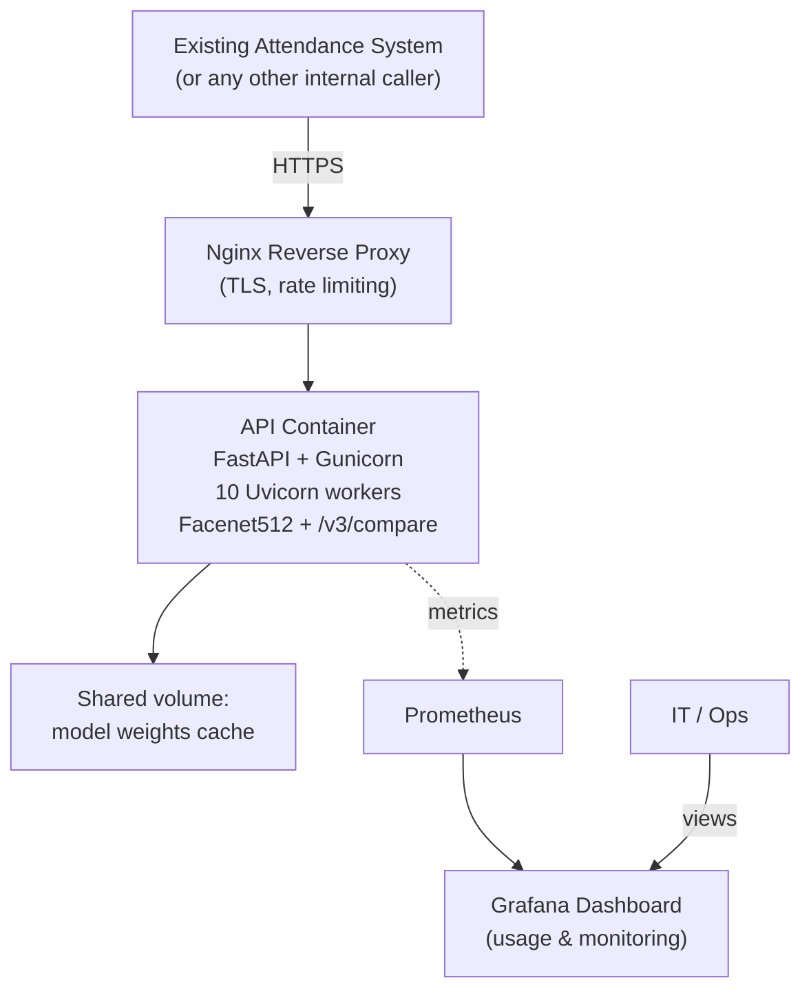
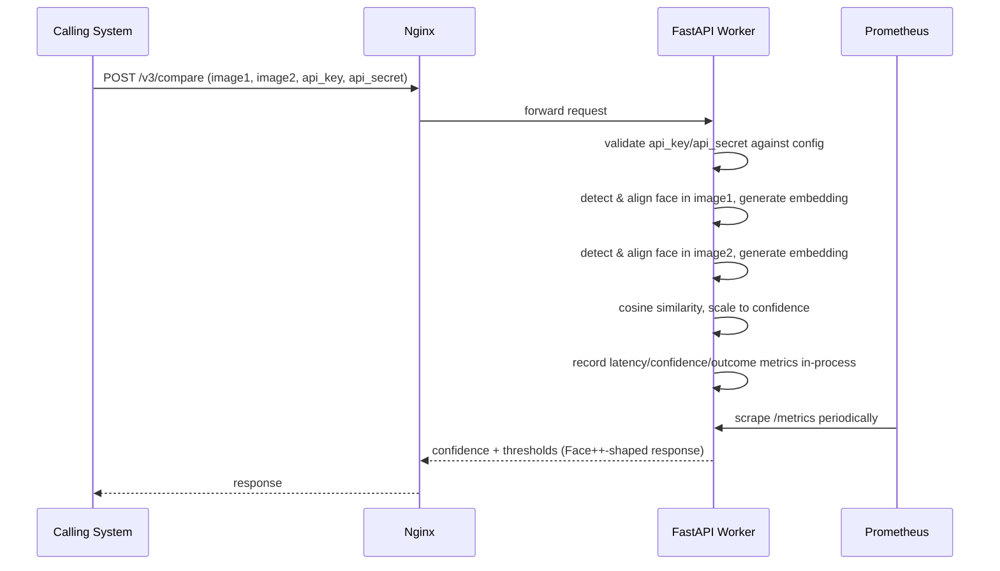

# PRD — Self-Hosted Face Comparison API (Face++ Replacement)

**Status:** Draft v1.3
**Owner:** [IT Project Manager]
**Type:** Infrastructure Migration (Proprietary Vendor → Self-Hosted Open Source)

---

## 1. Overview

The company currently relies on Face++ (Megvii)'s Compare API for face comparison, called today by an existing employee attendance system to verify clock-in/clock-out face captures. As usage scales (~6,000 requests/day across two daily attendance bursts), Face++'s per-call pricing is no longer sustainable.

This project replaces Face++ with a self-hosted, open-source comparison service that is purely a drop-in API substitute: it accepts two images — each as a URL, file upload, or base64 string — and returns a confidence score plus calibrated thresholds, exactly mirroring Face++'s Compare API contract. It has no concept of employees, enrollment, or attendance records. That logic lives entirely in the existing attendance system, which keeps its current responsibilities unchanged and simply points its API calls at this new service instead of Face++.

The scope of this PRD is therefore two things: (1) the comparison API itself, stateless and image-pair-only, and (2) a usage/monitoring dashboard so IT has the operational visibility Face++'s vendor console used to provide — request volume, latency, error rates, confidence score trends — without the service needing to know who anyone is.

Because this service still processes biometric data even without persisting employee identity, Indonesia's Personal Data Protection Law (UU PDP No. 27/2022) is still relevant to the act of processing face images, even transiently. But the consent and retention obligations for the images themselves remain the calling attendance system's responsibility — it captures the photos and knows whose face it is; this service never does. Section 9 makes that boundary explicit so it doesn't get blurred during implementation.

## 2. Requirements

- **Accuracy:** Recognition model must achieve a False Acceptance Rate (FAR) at or below Face++'s measured rate. Exact threshold to be confirmed once Face++'s current FAR/FRR figures are obtained (see Milestone 0).
- **Licensing:** Must use models fully free for commercial use, with no per-call cost and no restricted-license model weights. ArcFace/InsightFace Buffalo_L weights are explicitly excluded due to their non-commercial licensing terms. Approved model candidates: **Facenet512** (primary), **SFace** (fallback/lighter), **Dlib-ResNet** (secondary fallback).
- **Migration Compatibility:** The API must mirror Face++'s Compare API request/response contract exactly (Section 5.1) so the existing attendance system requires no logic changes — only an endpoint URL and credential swap.
- **Statelessness:** The comparison endpoint must not require, accept, or store any employee/identity parameter. It operates only on the two images supplied per request, with no database lookup involved in the comparison itself.
- **Throughput:** Sustain ~6,000 requests/day with two burst windows of ~3,000 requests each (around 9:00 AM and 6:00 PM). Exact burst width pending log data (Milestone 0) — sized conservatively for a 5-minute worst-case window (~10 req/sec).
- **Latency:** p95 end-to-end response time under 1.5 seconds, to avoid queue buildup at physical clock-in points during bursts.
- **Infrastructure:** Single Windows host (homelab repurposed as production), AMD Ryzen 7 5700G (8 physical cores / 16 threads via SMT), 16 GB RAM, CPU-only, running Docker via WSL2. Must run via Docker Compose for reproducible deployment.
- **CPU Feature Compatibility:** ✅ **Resolved.** AMD Ryzen 7 5700G natively exposes AVX and AVX2 — confirmed via CPU-Z. TensorFlow prebuilt wheels and ONNX Runtime will both work without modification. No illegal-instruction risk on this hardware.
- **Host OS Risk (new, flagged):** Windows is the host OS. This introduces a Windows Update forced-reboot risk that could take the service down during the 9:00 AM or 6:00 PM burst windows — exactly the highest-impact times. See Section 9, item 3 for the mitigation options and a recommended path.
- **RAM Constraint (new, binding):** 16 GB is shared between the Windows OS, WSL2/Docker runtime, all containers, and OS page cache. RAM is now the primary sizing constraint on this hardware, not core count. Worker count is sized around memory budget, not just CPU threads. See Section 5 for allocation detail.
- **Usage Monitoring:** Every request must be observable for operational purposes (latency, confidence score, outcome, calling client) without persisting the submitted images, and without any employee-identifying data, since the service has none to log.
- **Data Handling:** Submitted images are processed in memory and discarded immediately after comparison — never written to disk or database — mirroring Face++'s "no biometric data retained" behavior.

## 3. Core Features

1. **Face Comparison API**
   - Accepts exactly two images — `image1` and `image2` — each providable as `image_url`, `image_file` (multipart upload), or `image_base64`, with `image_file` > `image_base64` > `image_url` precedence per slot if more than one is supplied (matching Face++ exactly).
   - Authenticates via `api_key` + `api_secret`, checked against a small internal credential list — given the likely handful of internal systems calling this API, a config file / environment variables is sufficient; this is intentionally not a database-backed credential management system unless the number of callers grows enough to justify one.
   - Detects and aligns a face in each image, generates two embeddings, computes cosine similarity, and returns a `confidence` score (0–100) plus calibrated `thresholds` (1e-3 / 1e-4 / 1e-5 equivalents, derived from our own validation data in Milestone 0).
   - No employee ID, enrollment, or gallery concept anywhere in this endpoint. It is purely a two-image comparison utility — nothing else.

2. **Usage Logging & Monitoring Dashboard**
   - Every request increments structured metrics: request count (labeled by calling client and outcome), latency histogram, and confidence score histogram. No image data, and no employee data, is ever part of these metrics.
   - A Grafana dashboard (Section 5) visualizes: request volume over time with the two daily bursts clearly visible, p50/p95/p99 latency, error rate broken down by error code, confidence score distribution, and per-client request volume (useful once more than one internal system calls this API).
   - This replaces the operational visibility Face++'s vendor console used to provide, without the service needing to know anything about employees to do it.

3. **Health Endpoint**
   - `/health` for container orchestration checks, used by Docker Compose health checks.

## 4. User Flow

**Primary flow — Face Comparison Request:**
1. **Caller prepares two images:** The calling system (the existing attendance system, unchanged) has both images ready — typically a live capture and a reference photo — exactly as it does today when calling Face++. *(Open item carried over: confirm how the caller currently sources the reference image — this PRD doesn't need to know, but it's worth documenting for the team's own clarity.)*
2. **Submit:** Caller sends `image1`, `image2` (each as url/file/base64) and its `api_key`/`api_secret` to the compare endpoint.
3. **Detect & Embed:** Service detects and aligns a face in each image, then generates a 512-dimension embedding for each via Facenet512.
4. **Compare:** Service computes cosine similarity between the two embeddings.
5. **Respond:** Service returns `confidence` and `thresholds`, matching the Face++ response shape. What the caller does with that result — verifying an employee, logging attendance, triggering a fallback — is entirely the caller's logic, not this service's.
6. **Record metrics:** The request's latency, confidence score, and outcome are recorded as Prometheus metrics for the dashboard. No image, and no caller-side identity data, is retained anywhere.

**Secondary flow — IT/Ops reviews the dashboard:**
1. IT opens the Grafana dashboard.
2. Reviews request volume against the expected burst pattern, latency percentiles, and error rate.
3. Investigates anomalies (elevated latency during a burst, unexpected error spikes) using the per-client and per-error-code breakdowns.

## 5. Architecture

No database is part of this architecture. Credentials are read from environment variables / a mounted config file at container startup; usage data lives entirely in Prometheus's time-series store, which Grafana queries directly.

**Why single container instead of two:**
The previous draft ran two API containers for zero-downtime rolling updates. On a 16 GB Windows host, each container loads Facenet512 into memory independently per worker process — running two containers doubles model memory consumption without a second physical server to justify it. On this hardware, a single container with more workers is the correct trade-off: better memory efficiency, same total throughput. The operational cost is a brief planned downtime during updates (~30–60 seconds for container restart), which is acceptable given this is a single-server deployment without redundancy in any other layer anyway.

**Runtime resource allocation (Windows host, 16 GB RAM, Ryzen 7 5700G):**

RAM is the binding constraint. The allocation below is sized around memory budget, not CPU threads.

| Component | RAM budget | vCPU | Notes |
|---|---|---|---|
| Windows OS + WSL2 baseline | ~4 GB | 2–3 logical cores (background) | Windows page cache and system processes consume this regardless; WSL2 adds ~0.5–1 GB on top of bare OS |
| API Container (10 workers) | ~6–7 GB | 10 logical cores (pinned) | Each Gunicorn/Uvicorn worker holds one Facenet512 TF model instance in memory (~500–600 MB each); `OMP_NUM_THREADS=1` per worker |
| Nginx | ~50 MB | Negligible | |
| Prometheus | ~200–300 MB | Negligible | |
| Grafana | ~300–400 MB | Negligible | |
| OS page cache + headroom | ~1.5–2 GB | — | Needed to absorb burst memory spikes and prevent the kernel from aggressively swapping |
| **Total** | **~12–14 GB** | **~13 logical cores actively used** | Leaves ~2–4 GB buffer. Set `mem_limit` in `docker-compose.yml` to enforce caps and prevent one container from crowding Windows off RAM |

**Worker count rationale:** The Ryzen 7 5700G has 16 logical threads (8 cores × 2 via SMT). Inference work is partially compute-bound and partially memory-bandwidth-bound — SMT helps more here than it did on the Xeon VM's masked setup. 10 workers is the RAM-derived ceiling, not the thread ceiling (which would be 12–14 with headroom). This gives comfortable headroom over the ~10 req/sec worst-case burst without exhausting RAM.

**Sequence flow for a single comparison request:**

### 5.1 Face++ Compatibility & Migration Mapping

To keep the attendance system's integration code off the critical path, the new service exposes a `/facepp/v3/compare`-shaped endpoint that accepts the same parameters Face++'s Compare API accepts today and returns a response in the same shape. Internally it runs entirely on our own Facenet512/SFace pipeline — this is a compatibility shim at the API boundary, not a dependency on Face++ itself.

**Request mapping** (matching the official Face++ parameter spec exactly):

| Face++ parameter | Type | Required | New API behavior |
|---|---|---|---|
| `api_key` | String | Required | Validated against our internal config-based credential list instead of Face++'s; same field name accepted so caller code doesn't change |
| `api_secret` | String | Required | Same as above |
| `face_token1` | String | One of four (highest precedence) for image 1 | **Not implemented in v1.** Confirmed production usage relies only on `image_url1` / `image_file1` / `image_base64_1`, never `face_token1`. Documented here for completeness against the full Face++ spec — flagged in Milestone 0's endpoint inventory for confirmation. |
| `image_url1` | String | One of four (lowest precedence) | Supported |
| `image_file1` | File (multipart/form-data) | One of four (highest precedence among image inputs) | Supported |
| `image_base64_1` | String | One of four (middle precedence) | Supported |
| `face_token2`, `image_url2`, `image_file2`, `image_base64_2` | Same types | Same structure, for image 2 | Same handling as the `*1` parameters above, mirrored for the second image |

**Precedence rule (replicated exactly, per slot):** if more than one input is supplied for the same image, the service resolves them in the same order Face++ does — `image_file` > `image_base64` > `image_url` — so behavior doesn't silently change if a caller ever sends redundant fields.

**Response mapping:**

| Face++ field | New API field | Notes |
|---|---|---|
| `confidence` (0–100, 3 decimal places) | `confidence` | Cosine similarity rescaled to a 0–100 range, calibrated against our own FAR/FRR test set from Milestone 0 |
| `thresholds` (`1e-3`, `1e-4`, `1e-5`) | `thresholds` | Recomputed from our own validation data — **not** numerically interchangeable with Face++'s thresholds, only structurally compatible. Any caller logic hardcoding a specific Face++ threshold value must be re-pointed at our recalibrated values, not left as-is |
| `time_used` | `time_used` | Pass-through, measured server-side in milliseconds |
| `request_id` | `request_id` | Generated per-request for log correlation in application logs (not stored in a database) |
| `error_message` (e.g. `INVALID_FACE_TOKEN`) | `error_message` | Equivalent error codes for this service's failure modes — primarily `NO_FACE_DETECTED` (raised independently for `image1` or `image2`) and `INVALID_IMAGE` for malformed/unreadable input |

This compatibility layer is the service's permanent interface — see Section 9, item 6, for why there's no separate "native" endpoint planned to migrate to later.

## 6. Database Schema

This service intentionally has no database. There is no employee, enrollment, or attendance data for this PRD's scope to model — that data already lives in the existing attendance system and stays there unchanged. The only persistent state in this architecture is Prometheus's own time-series storage, which is operational infrastructure, not application schema, so it's not modeled here as an ERD.

If a future requirement needs longer historical detail than Prometheus's retention window comfortably provides (commonly 15–30 days depending on configuration), the lean next step is structured JSON log lines shipped to a log aggregator — not introducing a relational database for what would still just be usage telemetry.

## 7. Milestones

| Phase | Duration (est.) | Key Activities | Exit Criteria |
|---|---|---|---|
| **0. Discovery & Validation** | 1 week | AVX confirmed on target hardware (already resolved by CPU-Z); pull real burst-window timestamps from Face++ console/usage logs; inventory every Face++ endpoint actually used in production to confirm Compare is the only one in play and that `face_token` is genuinely unused; identify which threshold tier (1e-3/1e-4/1e-5) is currently used for accept/reject decisions; benchmark Facenet512 vs. SFace with latency measurement on this specific hardware; confirm FAR/FRR target against Face++'s current performance; decide on host OS path (keep Windows + WSL2, or reinstall Ubuntu Server) before any other infrastructure work — see Section 9, item 3 | OS decision confirmed; burst window confirmed with real data; model choice locked with measured accuracy numbers; compliance role clarified with legal |
| **1. Core Service Development** | 2–3 weeks | Build FastAPI compare endpoint matching the Face++ contract exactly (Section 5.1); integrate DeepFace/Facenet512; implement Prometheus metrics instrumentation; build the Grafana dashboard (request volume, latency, error rate, confidence distribution, per-client breakdown); Dockerize with Compose with explicit `mem_limit` per container; unit tests for detection, embedding, comparison, and the precedence-resolution logic | Service runs in Docker Compose; unit test suite passes; comparison works end-to-end for url/file/base64 inputs in all combinations; Grafana dashboard renders live data; container memory stays within budget under sustained load |
| **2. Integration** | 1 week | Point the existing attendance system at the new endpoint with only a URL/credential change — no logic change expected on the caller's side, since the contract is unchanged | Attendance system successfully calls the new endpoint in staging with zero code changes beyond configuration |
| **3. Testing** | 2 weeks | Execute SIT (functional + edge cases), load/burst testing, security review, side-by-side confidence-score comparison against Face++ on the same image pairs, dashboard accuracy validation — see Section 8. Also: verify Windows Update Active Hours are configured to exclude 07:00–19:00 to prevent reboot during burst windows | All SIT test cases pass or have signed-off exceptions; load test confirms p95 latency target under simulated burst; security review has no open critical findings; Active Hours configured and verified |
| **4. Pilot / Parallel Run** | 2–4 weeks | Run new service in parallel with Face++ on production-shaped traffic; tune similarity threshold based on real-world FAR/FRR data | Parallel run shows accuracy parity or better vs. Face++; threshold finalized; dashboard actively used by IT during pilot |
| **5. Cutover & Hypercare** | 1 week cutover + 2 weeks hypercare | Switch the attendance system's credentials/endpoint to the new service exclusively; decommission Face++ API keys; IT on standby for rapid response, using the dashboard as the primary monitoring tool | Face++ contract can be safely terminated; 2 weeks of stable production operation with no unplanned downtime |

Note: durations assume a small dedicated team (1-2 backend engineers, 1 QA, part-time IT ops). Adjust based on actual team capacity.

## 8. Testing Strategy

**Unit Testing**
- Face detection wrapper: correctly identifies zero/one/multiple faces in test images.
- Embedding generation: consistent output dimensionality and stability (same image → same embedding within floating-point tolerance).
- Similarity/threshold logic: correct behavior at boundary conditions.
- Input precedence logic: confirm `image_file` > `image_base64` > `image_url` resolution per slot when multiple inputs are supplied.
- API contract tests for the compare endpoint (input validation, error responses) — confirming no employee/identity parameter is accepted or required anywhere.

**System Integration Testing (SIT)**
- End-to-end comparison flow: submit → detect → embed → compare → respond, across a known set of test image pairs covering same-person and different-person cases.
- Edge cases: poor lighting, partial occlusion (mask, glasses), face angle variation, lookalike pairs (siblings/twins if available) to validate FAR behavior.
- Input format coverage: each of url/file/base64 for both image slots, individually and in combination, confirming precedence resolution.
- Metrics correctness: confirm Prometheus counters/histograms increment correctly for both success and error paths, with no PII or image data ever present in metric labels.
- Memory stability: confirm `docker stats` shows RSS stays within the `mem_limit` cap across the full SIT run — not just at startup.

**Performance / Load Testing**
- Simulate the confirmed burst window (from Milestone 0 data) using k6 or Locust, ramping to worst-case request rate.
- Measure p50/p95/p99 latency, CPU utilization, container memory usage, and error rate under sustained burst load.
- Confirm `OMP_NUM_THREADS=1` tuning holds under real concurrent load — validate on this hardware, not assumed from theory.
- Soak test: run at expected average daily load for several hours to catch memory leaks and WSL2 memory reclaim behavior (WSL2 is known to hold onto freed memory longer than a native Linux host; confirm it doesn't grow unbounded during a soak run).

**Accuracy Validation (FAR/FRR)**
- Build a labeled test set of image pairs (with appropriate consent) covering the conditions above.
- Measure actual FAR (wrongly accepted) and FRR (wrongly rejected) at the candidate similarity threshold.
- Compare directly against Face++'s measured FAR/FRR on the same or equivalent test set — the core acceptance gate for this migration.
- Run the same image pairs through both Face++'s Compare API and the new endpoint, log both confidence scores side-by-side, and confirm accept/reject decisions agree at the threshold tier currently used in production. Disagreements reviewed individually before pilot.

**Security Review**
- Verify submitted images are never written to disk or persisted in logs/metrics.
- Verify `api_key`/`api_secret` validation rejects invalid or missing credentials correctly, and that credentials aren't logged in plaintext anywhere.
- Confirm metrics and logs contain no image data and no caller-side identity information, by design rather than by convention.

**User Acceptance Testing (UAT)**
- IT/Ops uses the Grafana dashboard during the parallel-run period to confirm it provides the operational visibility Face++'s console used to provide.
- Defined rollback trigger: if FAR/FRR materially exceeds Face++'s baseline during pilot, halt rollout and return to Milestone 0 model tuning rather than proceeding on schedule.

## 9. Design & Technical Constraints

1. **High-Level Technology:** Python-based service (FastAPI recommended for async support and OpenAPI docs out of the box) wrapping DeepFace with Facenet512 as the default backend, SFace as a configurable fallback. Deployed entirely via Docker Compose on a single Windows host running Docker via WSL2. No Kubernetes, no GPU, no database, no external managed services required at current scale.

2. **Model & Licensing Constraint:** Only Facenet512 (MIT), SFace (Apache 2.0), or Dlib-ResNet (Boost license) may be used as the recognition backend. ArcFace models using InsightFace's Buffalo_L/M/S or AntelopeV2 weights are explicitly prohibited unless a commercial license is purchased directly from InsightFace.

3. **Host OS Risk & Mitigation Options (Windows):** Windows Update can force a reboot at any time outside of configured Active Hours, including during the 9 AM and 6 PM attendance burst windows. Three options, in order of preference:

   - **Option A (Recommended) — Reinstall Ubuntu Server 22.04 LTS:** Eliminates the reboot risk entirely. Docker Compose runs natively with no WSL2 memory overhead or reclaim quirks. Roughly 1–2 hours of setup work upfront, saves ongoing risk management for the life of the system. Recommended if the hardware is dedicated to this service.
   - **Option B — Keep Windows, mitigate:** Set Active Hours to 06:00–22:00 (the maximum 18-hour Windows 10/11 window), use the Windows Update settings to defer feature updates, and configure Docker/WSL2 to auto-start on Windows startup. WSL2 memory overhead (~0.5–1 GB) and memory reclaim latency remain as operational characteristics but are manageable. This path requires a written policy for who handles emergency restarts and how the service recovers — not optional.
   - **Option C (Rejected) — Ignore the risk:** Not acceptable for a service tied to payroll-linked attendance at defined burst times.

   The OS decision must be confirmed and actioned in Milestone 0 before any other infrastructure work starts — it affects where Docker is installed, how the systemd/service autostart is configured, and the soak test interpretation (WSL2 memory behavior differs from native Linux).

4. **Memory Management:** Set explicit `mem_limit` in `docker-compose.yml` for each container. The API container should be capped at ~7 GB; Prometheus at 512 MB; Grafana at 512 MB. Without limits, Docker on WSL2 can allow a single container to consume all available RAM and force Windows into aggressive page swapping, taking the entire host down. Validate these limits hold under the Phase 3 load test before treating them as confirmed.

5. **Concurrency Configuration:** Each API worker process must run with `OMP_NUM_THREADS=1` (and equivalent TF/ONNX intra-op thread count to 1). With 10 workers on 16 logical threads, this leaves 6 logical threads available for WSL2 kernel work, Nginx, Prometheus, Grafana, and the Windows host layer — intentional, not wasted capacity.

6. **Compatibility Shim Lifecycle:** The `/v3/compare` Face++-compatible endpoint shape (Section 5.1) is the service's permanent interface — there is no separate "native" endpoint planned to migrate to later. The one true transition item is decommissioning Face++ credentials and contract once cutover completes.

7. **Deployment Conventions:** All services defined in a single `docker-compose.yml` with pinned image versions (no `latest` tags in production). Model weights cached in a named Docker volume to avoid re-downloading on container restart. API credentials supplied via environment variables or a mounted `.env` file, excluded from version control. WSL2 autostart on Windows boot must be configured and tested before cutover.

---

**Open items requiring confirmation before Phase 0 closes:**
- **Host OS decision** (Option A vs B from Section 9, item 3) — must be resolved before any infrastructure setup begins.
- Exact burst-window duration from Face++ console/usage logs.
- Confirmation that Compare API is the only Face++ endpoint in production use.
- Confirm no caller anywhere actually sends `face_token1`/`face_token2` — worth a quick check across the attendance system's integration code.
- Which FAR threshold tier (1e-3 / 1e-4 / 1e-5) is currently configured for accept/reject decisions in production.
- Face++'s measured FAR/FRR baseline (from Face++ account history or historical dispute data).
- This service's data-processor role under UU PDP — confirm with legal that "process but never persist" is sufficient to keep this service out of controller-level obligations.
- Confirmed team/resourcing for the milestone timeline above.
